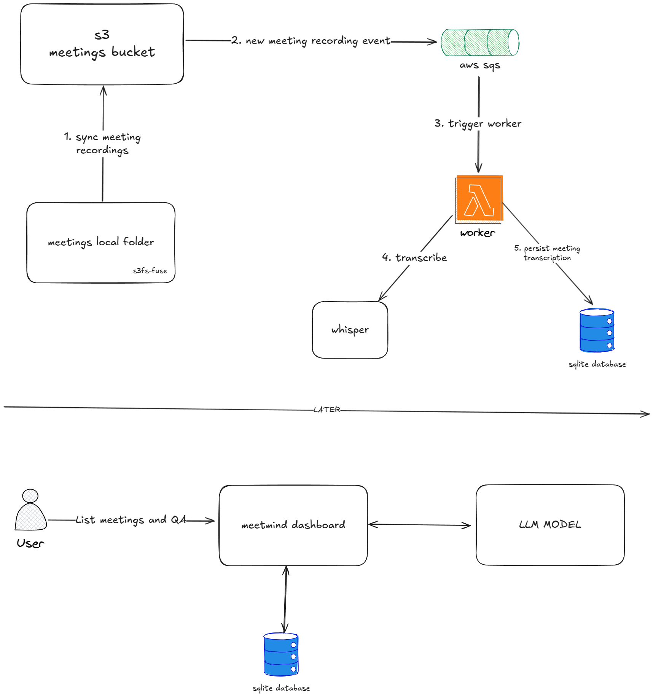

# Meetmind

Supermemory for your meetings - transcribe all your meetings and have conversations with them later

# Tech Stack

- Gemini for QA
- Whisper for transcription (groq API)
- Sqlite for database (turso)
- Nextjs with Typescript for the app framework
- AWS S3, SQS, Lambda for meetings processing (worker)
- s3s-fuse for sync in real time local folder meetings with s3 bucket
- Shadcn for UI components & TailwindCSS for styling

# Architecture

Meetmind is heavily focused on AWS services. But if your cloud provider has some alternative to aws s3, sqs and lambda functions, you can port or replicate the same architecture

# Deployment

## Worker

Meetmind uses CDK to deploy worker infra. The infrastructure is defined in the `iac` folder. You can deploy the stack in your AWS account. There is a github action if you need some reference (`/.github/workflows/cdk-deploy.yaml`)

## Meetmind Dashboard

You can deploy the nextjs app with any service that supports it (e.g: vercel, aws, etc)

Personally i run meetmind dashboard on my local raspberry pi 5 using docker. I expose it using Cloudflare tunnels with strong authentication. I heavily recommend this approach if you just need something very cheap and easy to deploy.
